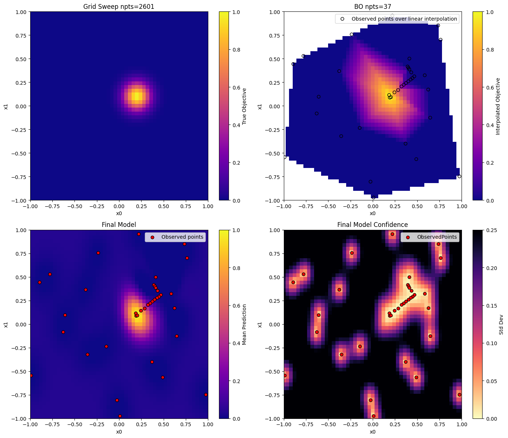
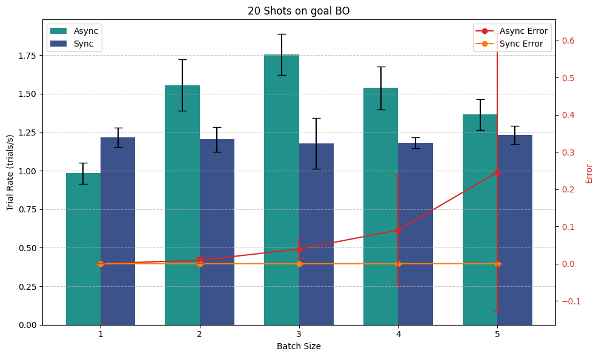

# Overview
This repository contains a working Jupyter notebook demonstration of Bayesian Optimization using [`ax_platform==0.4.3`](https://github.com/facebook/Ax). We employ a synthetic 2D Gaussian "peak" function as the objective and demonstrate optimization strategies ranging from a brute-force grid search to a guided Bayesian Optimization (BO) process.

### Traditional Grid Search (Left) vs. Bayesian Optimization (Right)

The figure below shows a comparison of a traditional grid search approach on the left and a Bayesian Optimization approach on the right. The grid search exhaustively samples a dense grid of points across the parameter space, whereas the Bayesian Optimization adaptively selects points to evaluate, leveraging a probabilistic model to converge more efficiently to the global optimum.

### Configuring the Optimization Mode

This figure shows how different configurations e.g., synchronous vs asyncrounous and batch size can impact the optimization rate:

---

# Key Concepts of the Bayesian Optimization (BO) Approach

1. **Objective Function: A Gaussian Peak**

   We define our objective function \( f(x,y) \) as a 2D Gaussian centered at \((x=0.2, y=0.1)\) with a standard deviation of \(0.1\):

   %3D%5Cexp%5Cleft(-%5Cfrac%7B(x-0.2)%5E2%2B(y-0.1)%5E2%7D%7B2%5Ccdot(0.1)%5E2%7D%5Cright))

   This function provides a smooth, unimodal landscape, ideal for demonstrating how an optimizer can efficiently converge to the peak.

2. **Parameter Space**

   - **Parameters**: \( x, y \)
   - **Bounds**: Both \( x \) and \( y \) range from \(-1\) to \(1\).
   
   This well-defined and normalized parameter space ensures the optimizer works over a finite and manageable domain.

3. **Grid Sweep (Reference Baseline)**

   A grid search is performed over a \(51 \times 51\) grid, evaluating \( f(x,y) \) at each point. While this brute-force approach gives a full overview of the surface, it is computationally expensive for higher-dimensional problems. Nevertheless, it serves as a useful baseline and visualization tool.

   By examining the color map generated from the grid, we gain a comprehensive understanding of where the global maximum lies before applying more intelligent sampling methods.

4. **Bayesian Optimization Setup with Ax**

   Bayesian optimization leverages a surrogate model (commonly a Gaussian Process) to reason about the objective function. The Ax platform simplifies specifying:

   - **Initial Exploration (Sobol)**:
     The process begins with a batch of Sobol-generated samples to cover the parameter space evenly. This ensures a good initial "map" of the landscape.

   - **Subsequent Exploitation (GPEI)**:
     After initial sampling, a Gaussian Process (GP) model is used in conjunction with the Expected Improvement (EI) acquisition function. The GP surrogate models the observed data and predicts unobserved points. EI guides the selection of the next points by balancing **exploitation** (sampling near known good points) and **exploration** (reducing uncertainty in less-sampled regions).

   - **Exploration Phase (qNIPV)**:
     To prevent getting stuck in local maxima, the optimization occasionally switches to an exploration-driven criterion like Negative Integrated Posterior Variance (qNIPV). This helps refine the surrogate model and encourages discovering new promising areas.

5. **Adaptive Strategy: Exploitation vs. Exploration**

   Each iteration decides whether to exploit or explore:
   
   - **Exploitation (GPEI)**: Focus on areas likely to improve the current best point.  
   - **Exploration (qNIPV)**: Sample points in less known regions to improve the model and find potentially better maxima.

   A probability (`explore_ratio`) controls how often the optimizer explores instead of exploits, ensuring a balanced search.

6. **Stopping Criteria**

   To limit unnecessary computations, we introduce early stopping conditions:
   
   - **Threshold**: If the best observed value surpasses a predefined threshold, stop early.
   - **Epsilon and Patience**: If consecutive exploitation steps fail to improve the best value by at least `epsilon` for a certain number of steps (`patience`), the algorithm stops. This prevents endlessly searching once significant improvements are unlikely.

   These stopping criteria make Bayesian Optimization practical for scenarios where evaluations are expensive.

7. **Normalization and Standardization**

   For robust model fitting:
   
   - **Input Normalization**: Ensures all parameters lie in similar numeric ranges, improving model stability.
   - **Output Standardization**: The objective values are standardized to have zero mean and unit variance, aiding the GP in more accurate and stable predictions.

8. **Visualization**

   Two key plots help interpret the optimization process:
   
   - **Grid Sweep Plot**: Shows the true function values across the parameter space. This "map" is a reference for how close our optimizer comes to the global maximum.
   
   - **Bayesian Optimization Plot**: Displays the points chosen by the optimizer overlaid on an interpolated surface built from these points. This lets us see how the optimizer moves from broad exploration to narrow exploitation, honing in on the peak.

---

# Some "Flash Cards" on BO

1. **Gaussian Peak Function**:  
   A simple and smooth function that represents our "test problem", enabling us to understand the BO process on a known landscape.

2. **Grid Sweep**:  
   Provides a brute-force baseline. While computationally expensive, it's an excellent visualization tool and reference.

3. **Bayesian Optimization Steps**:  
   Sequential decision-making on which points to sample next, informed by a surrogate model (GP) and an acquisition function (EI or qNIPV).

4. **Balance Between Exploration and Exploitation**:  
   Maintains progress towards global optimum rather than prematurely converging to a local maximum.

5. **Stopping Conditions**:  
   Efficiently halt the search when further improvements are unlikely, saving computational resources.

---

This notebook and codebase demonstrate how these concepts integrate seamlessly with `ax_platform`. By walking through initial random sampling, modeling steps, adaptive exploration-exploitation trade-offs, and early stopping, you can get a practical sense of how Bayesian Optimization tackles real-world, black-box optimization tasks efficiently.
