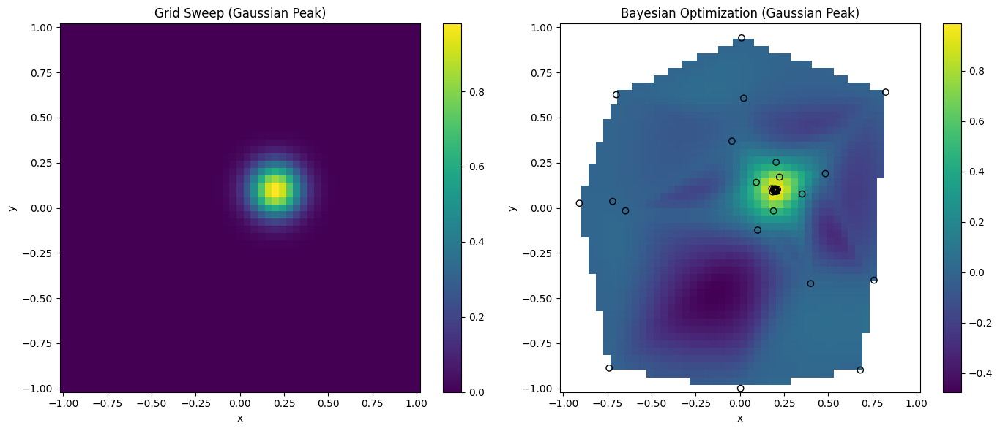

# Basic BO
This tutorial is just to showcase a basic implementation of Bayesian optimization using ax.dev

### Traditional Grid Search on left, BO on right

### Now with 90% exploitation & 10% exploration | scalarized inputs, standardized outputs in model fitting 

