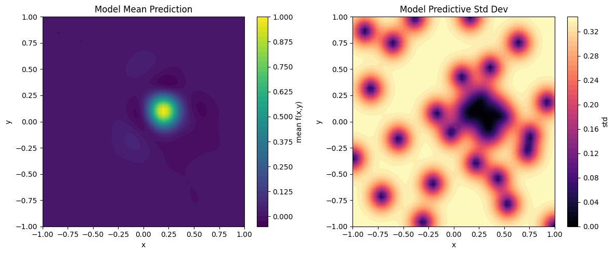

# Bayesian Optimization Demonstration

This repository contains a Jupyter notebook that demonstrates Bayesian Optimization (BO) using [`ax_platform==0.4.3`](https://github.com/facebook/Ax). We utilize a synthetic 2D Gaussian peak function as the objective and compare optimization strategies from brute-force grid search to guided Bayesian Optimization.

## Overview

### Traditional Grid Search vs. Bayesian Optimization

The figure above compares a traditional grid search (left) with Bayesian Optimization (right). Grid search exhaustively samples a dense grid across the parameter space, while Bayesian Optimization adaptively selects evaluation points using a probabilistic model to efficiently converge to the global optimum.

### Optimized Model

After completing BO, we plot the final model's mean and standard deviation, illustrating the optimized surrogate.

### Configuring the Optimization Mode

This figure demonstrates how different configurations, such as synchronous vs. asynchronous execution and varying batch sizes, impact the optimization rate.

---

## Key Concepts of Bayesian Optimization (BO)

1. ### Objective Function: A Gaussian Peak

   We define our objective function f(x, y) as a 2D Gaussian centered at x=0.2, y=0.1 with a standard deviation of 0.1:

   

   This smooth, unimodal landscape is ideal for showcasing how an optimizer efficiently converges to a peak.

2. ### Parameter Space

   - **Parameters**: x, y
   - **Bounds**: Both x and y range from -1 to 1.

   A well-defined, normalized parameter space ensures the optimizer operates within a finite and manageable domain.

3. ### Grid Sweep (Reference Baseline)

   We perform a grid search over a 51 by 51 grid, evaluating f(x, y) at each point. While this brute-force approach provides a comprehensive overview of the surface, it becomes computationally expensive for higher-dimensional or expensive-to-sample problems.

4. ### Bayesian Optimization Setup with Ax

   Bayesian Optimization employs a surrogate model, typically Gaussian Process Regression (GPR), to model the objective function. The Ax platform facilitates the setup by specifying:

   - **Initial Exploration ([Sobol-generated](https://en.wikipedia.org/wiki/Variance-based_sensitivity_analysis) samples)**:
     Begins with a batch of Sobol-generated samples to evenly cover the parameter space, establishing a reliable initial "map" of the landscape.

   - **Subsequent Exploitation (GPEI)**:
     Utilizes a Gaussian Process model combined with the Expected Improvement (EI) acquisition function. The GP models observed data and predicts unobserved points, while EI balances **exploitation** (sampling near known good points) and **exploration** (reducing uncertainty in less-sampled regions).

   - **Exploration Phase (qNIPV)**:
     Occasionally switches to a criterion like Negative Integrated Posterior Variance (qNIPV) to prevent the optimizer from getting stuck in local maxima. qNIPV minimizes the global uncertainty of the model without bias toward any specific direction.

5. ### Adaptive Strategy: Exploitation vs. Exploration

   Each iteration decides between exploitation and exploration based on a defined probability (`explore_ratio`):

   - **Exploitation (GPEI)**: Focuses on areas likely to improve the current best point.
   - **Exploration (qNIPV)**: Samples points in less-known regions to enhance the model and discover new promising areas.

   This balance ensures efficient search towards the global optimum without premature convergence.

6. ### Stopping Criteria

   To prevent unnecessary computations, we implement early stopping conditions:

   - **Threshold**: Stops early if the best observed value surpasses a predefined threshold.
   - **Epsilon and Patience**: Halts if consecutive exploitation steps do not improve the best value by at least epsilon for a certain number of steps (patience), avoiding endless searching when significant improvements are unlikely.

   These criteria make BO practical for scenarios with expensive evaluations.

7. ### Normalization and Standardization

   For robust model fitting:

   - **Input Normalization**: Ensures all parameters lie within similar numeric ranges, enhancing model stability.
   - **Output Standardization**: Standardizes objective values to have zero mean and unit variance, aiding the GP in accurate and stable predictions.

8. ### Visualization

   - **Grid Sweep Plot**: Displays the true function values across the parameter space, serving as a reference for the optimizer's performance.
   - **Bayesian Optimization Plot**: Shows optimizer-selected points over an interpolated surface from these points, illustrating the transition from broad exploration to focused exploitation.

---

## Key Concepts Summary

- **Objective Function**: A controlled 2D Gaussian peak used to understand the BO process on a known landscape.
- **Parameter Space**: Normalized parameters x and y ranging from -1 to 1.
- **Grid Sweep**: A brute-force baseline providing exhaustive coverage, useful for visualization and reference.
- **Bayesian Optimization Steps**: Involves sequential decision-making on point selection using a surrogate model (GP) and acquisition functions (EI, qNIPV).
- **Exploration vs. Exploitation**: Balances global search with local optimization to ensure convergence to the global optimum.
- **Stopping Conditions**: Efficiently terminates the search when further improvements are unlikely, conserving computational resources.

---

This notebook and codebase demonstrate the integration of these concepts with `ax_platform`. By following the workflow—from initial random sampling and model updates to adaptive exploration-exploitation trade-offs and early stopping—you gain practical insights into how Bayesian Optimization efficiently tackles real-world, black-box optimization tasks.

## Further Reading

Explore real-life Ax development demos where BO accelerates materials discovery:

- [PASCAL: The Perovskite Automated Spin Coat Assembly Line Accelerates Composition Screening in Triple-Halide Perovskite Alloys](https://pubs.rsc.org/en/content/articlelanding/2024/dd/d4dd00075g)

- [Bayesian Optimization and Prediction of the Durability of Triple-Halide Perovskite Thin Films Under Light and Heat Stressors](https://pubs.rsc.org/en/content/articlelanding/2024/ma/d4ma00747f)
