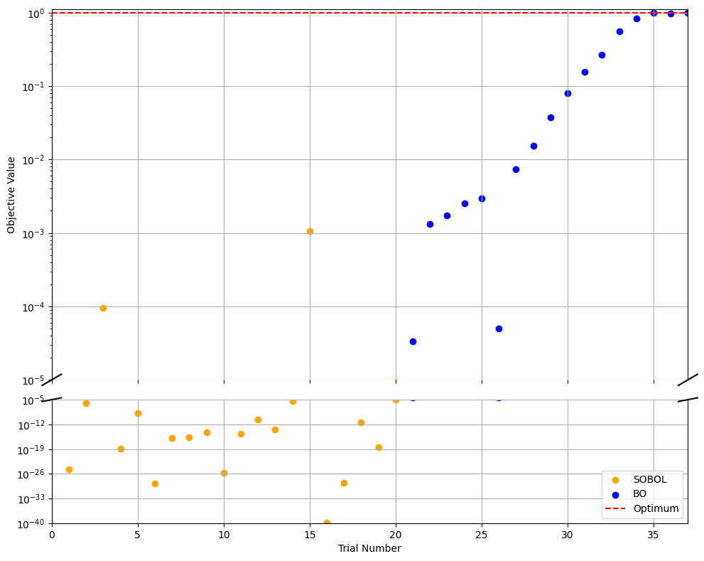

# Bayesian Optimization with https://ax.dev/

This repo demonstrates active learning using [`ax_platform==0.4.3`](https://github.com/facebook/Ax) to conduct Bayesian optimization and compares its result to traditional grid search design of experiment.

---

## Overview

### Traditional Grid Search vs. Bayesian Optimization

The figure above compares a traditional grid search (upper left) with Bayesian Optimization (upper right). Lower right shows the resulting final model, along with its predictive standard deviation (lower right).

### Convergence 

Typically BO is initilized with random sampling of the search space, here we use SOBOL. After initilization the model uses observed data to update the surrogate model. Expected Improvement is then used to generate new trials. 

### Configuring the Optimization Mode

The tutorial showcases Ax's ability to operate in synchronous or asynchronous mode with varying batch sizes. The figure demonstrates the trade-offs between rate and error on a short 20-shot-on-goal experiment.

---

## Key Concepts of Bayesian Optimization (BO)

### 1. Objective Function: A Gaussian Peak

We define our objective function f(x, y) as a 2D Gaussian centered at x = 0.2, y = 0.1 with a standard deviation of 0.1:

---

### 2. Parameter Space

- **Parameters**: x, y
- **Bounds**: Both x and y range from -1 to 1.
- Note: Parameters and bounds do not need to be normalized; Ax handles normalization internally.

---

### 3. Grid Sweep (Reference Baseline)

We perform a grid search over a 51x51 grid, evaluating f(x, y) at each point. While this brute-force approach provides a comprehensive overview of the surface, it becomes computationally expensive for higher-dimensional or expensive-to-sample problems.

---

### 4. Bayesian Optimization Setup with Ax

Bayesian Optimization leverages a surrogate model, typically Gaussian Process Regression (GPR), to model the objective function and guide sampling. The Ax platform enables this process through a well-structured workflow:

#### 4.1 Initial Exploration ([Sobol-generated](https://en.wikipedia.org/wiki/Variance-based_sensitivity_analysis) samples)

- A batch of pseudo-random Sobol-generated samples is used to cover the parameter space evenly. This phase establishes a broad understanding of the landscape, providing a foundation for further refinement.

#### 4.2 Adaptive Sampling

- Subsequent iterations adaptively alternate between:
  - **Exploitation**: Using Gaussian Process Expected Improvement (GPEI) to sample near known promising points and refine the model in areas of interest.
  - **Exploration**: Using Negative Integrated Posterior Variance (qNIPV) to sample in less-explored regions and reduce global uncertainty.

This adaptive strategy ensures efficient progress toward the global optimum while avoiding local maxima.

---

### 5. Adaptive Strategy: Balancing Exploitation and Exploration

The balance between exploitation and exploration is controlled probabilistically through a defined `explore_ratio`:

#### 5.1 Exploitation (GPEI)

- Focuses on improving the current best-known result by sampling near high-performing areas.

#### 5.2 Exploration (qNIPV)

- Samples in regions with high uncertainty to enhance the model's understanding of the entire parameter space.

This dynamic approach prevents the optimizer from prematurely converging on local optima and promotes thorough exploration of the search space.

---

### 6. Stopping Criteria

To prevent unnecessary computations, we implement early stopping conditions:

- **Threshold**: Stops early if the best observed value surpasses a predefined threshold.
- **Epsilon and Patience**: Halts if consecutive exploitation steps do not improve the best value by at least epsilon for a certain number of steps (patience), avoiding endless searching when significant improvements are unlikely.

These criteria make BO practical for scenarios with expensive evaluations.

---

## Key Concepts Summary

- **Objective Function**: A controlled 2D Gaussian peak used to understand the BO process on a known landscape.
- **Parameter Space**: Parameters x and y with respective search ranges. Ax handles normalization and standardization in the back end.
- **Grid Sweep**: A traditional way of experiment design where a full factorial of your parameters are observed. 
- **Bayesian Optimization Steps**: Sequential decision-making on point selection using a surrogate model (GP) and acquisition functions (EI, qNIPV).
- **Exploration vs. Exploitation**: Balances global search with local optimization to ensure convergence to the global optimum.
- **Stopping Conditions**: Efficiently terminates the search when further improvements are unlikely, conserving computational resources.

---

## BO in action: 

- [PASCAL: The Perovskite Automated Spin Coat Assembly Line Accelerates Composition Screening in Triple-Halide Perovskite Alloys](https://pubs.rsc.org/en/content/articlelanding/2024/dd/d4dd00075g)
- [Bayesian Optimization and Prediction of the Durability of Triple-Halide Perovskite Thin Films Under Light and Heat Stressors](https://pubs.rsc.org/en/content/articlelanding/2024/ma/d4ma00747f)
